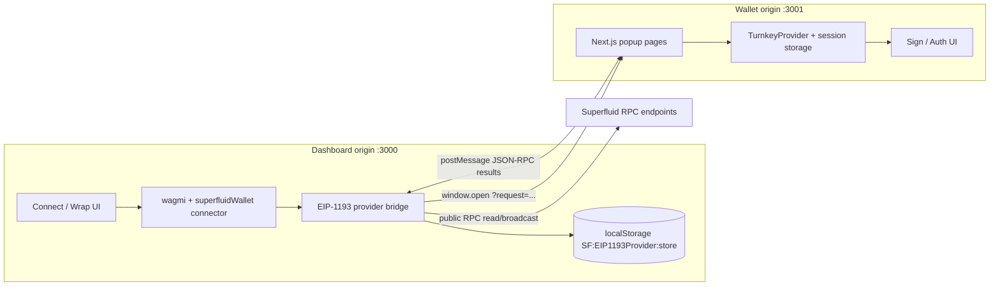
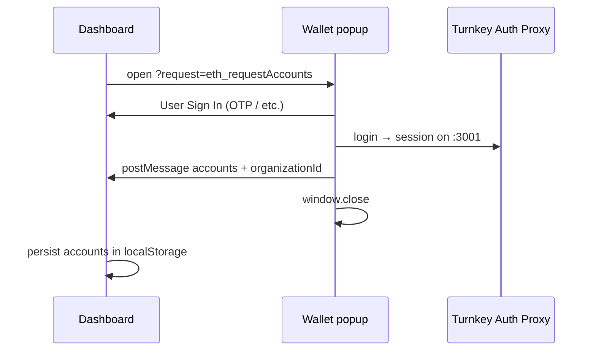
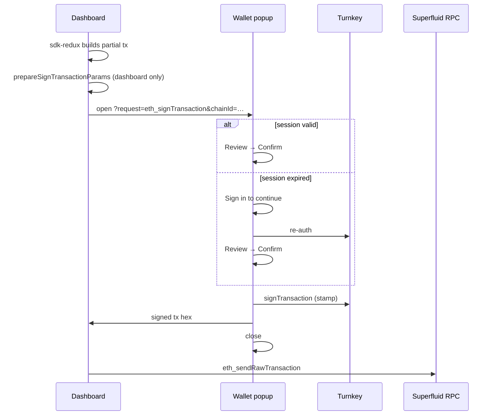

# Superfluid Wallet × Dashboard integration (PoC retrospective)

**Status:** Proof-of-concept, feature-flagged.  
**Audience:** Engineers continuing Superfluid Wallet integration work.

Operational runbook for the wallet app alone: [`superfluid-wallet/README.md`](../superfluid-wallet/README.md).  
Vocabulary (Provider vs Wallet vs Client): [`wallet-terminology.md`](wallet-terminology.md).

---

## What we built

A **hosted popup wallet** (Turnkey Auth Proxy + `@turnkey/react-wallet-kit`) integrated into the Superfluid Dashboard as a **second connect path** alongside Web3Modal.

| Surface | Role |
|--------|------|
| Dashboard (`:3000`) | Dapp: wagmi, UI, transaction construction (e.g. wrap via sdk-redux) |
| `src/features/wallet/superfluidWallet/` | **EIP-1193 provider bridge** — opens popup, routes RPC, persists address metadata |
| `superfluid-wallet/` (`:3001`) | **Wallet** — Turnkey auth, consent UI, transaction/message signing |

Enabled only when `NEXT_PUBLIC_SUPERFLUID_WALLET_ENABLED=true`. Production target URLs: dashboard `https://app.superfluid.org`, wallet `https://wallet.superfluid.org` (not deployed in this iteration).

**Verified transaction path in PoC:** Optimism Sepolia (`11155420`) wrap/upgrade (`superTokenUpgrade`). Other flows are chain-agnostic in code but not systematically tested.

---

## Architecture

Two browser origins cooperate via **`window.open` + `postMessage`**. The dashboard never imports wallet React code.



### Two kinds of “connection”

Do not conflate these:

| State | Stored on | Meaning |
|-------|-----------|---------|
| **Dashboard connection** | `:3000` `localStorage` | Last known `accounts[]` + `organizationId` + `chainId` for wagmi |
| **Turnkey read-write session** | `:3001` (SDK storage) | Credentials used to **stamp** signatures; has `expiry` |

The dashboard can show **Connected** while the Turnkey session on `:3001` is expired. Signing must recover auth **inside the sign popup** (see [Session behavior](#session-behavior)).

---

## Provenance: Turnkey `popup-wallet-demo`

Initial implementation copied Turnkey’s **`popup-wallet-demo`** reference (two apps: dapp provider bridge + hosted wallet popup). File mapping:

| Reference path (`popup-wallet-demo`) | This repository | Purpose |
|--------------------------------------|-----------------|---------|
| `apps/dapp/lib/connector.ts` | `src/features/wallet/superfluidWallet/connector.ts` | wagmi `createConnector` |
| `apps/dapp/lib/eip1193-provider.ts` | `src/features/wallet/superfluidWallet/eip1193-provider.ts` | Popup + `postMessage` + RPC routing |
| `apps/wallet/*` | `superfluid-wallet/*` | Hosted wallet Next.js app |

---

## Adaptations vs the reference demo

| Area | Reference demo | This repo |
|------|----------------|-----------|
| Connector ID / name | `turnkeyWallet` | `superfluidWallet` / “Superfluid Wallet” |
| Wallet URL | Hardcoded `localhost:3001` | `NEXT_PUBLIC_SUPERFLUID_WALLET_URL` |
| Public RPC | Single Sepolia env URL | `networks.ts` → `rpcUrls.superfluid.http[0]` per active `chainId` |
| Wallet signing `chainId` | Fallback to Sepolia in signer | Requires `chainId` from provider / tx; wallet normalizes fees via Superfluid RPC map |
| Dashboard package | N/A | Feature flag; no Turnkey UI deps in dashboard |
| Connect UX | Single connect | Primary “Connect Superfluid Wallet”, secondary Web3Modal |
| Partial wrap txs | Demo dapp prepared txs in UI | Dashboard: `prepareSignTransactionParams` before popup; wallet: `normalizeEip1559Transaction` |
| Turnkey `signWith` | Raw address from tx | `resolveTurnkeySignWith` — case-sensitive match to wallet accounts |
| Expired session | Implicit / reconnect | `SignSessionGate` + inline **Sign in to continue** in sign popup |
| Popup lifecycle | Reuse open popup if present | Close prior popup before new popup request |

**Added modules (dashboard bridge only):**

- `prepareSignTransactionParams.ts` — viem `prepareTransactionRequest` for `eth_signTransaction` only
- `resolvePopupParams.ts` — dispatches prepare vs `enrichPopupRequest`
- `enrichPopupRequest.ts` — chainId injection for non-sign popup methods

**Added modules (wallet app):**

- `lib/normalize-rpc-transaction.ts` — complete EIP-1559 fields when missing
- `lib/resolve-turnkey-sign-with.ts` — `signWith` + org ID resolution
- `lib/use-turnkey-signing-ready.ts` — loading / ready / needs_auth
- `components/sign-session-gate.tsx` — session gate before review UI
- `components/auth.tsx` — `variant="connect" | "unlock"` (unlock does not close popup or emit `eth_requestAccounts`)

---

## Request flows

### Connect (`eth_requestAccounts`)



### Wrap (`eth_sendTransaction` → sign → broadcast)



`eth_sendTransaction` on the provider is implemented as **sign in popup** then **`eth_sendRawTransaction`** via the same public RPC routing as reads.

---

## Repository layout

```
dashboard/
├── docs/
│   ├── superfluid-wallet-integration.md   ← this document
│   └── wallet-terminology.md
├── src/features/wallet/
│   ├── superfluidWallet/                  ← EIP-1193 bridge + connector
│   ├── wagmiConfig.ts                     ← registers connector when flagged
│   ├── ConnectWallet.tsx                  ← dual CTAs
│   └── ConnectButtonProvider.tsx          ← connectSuperfluidWallet()
├── src/utils/config.ts                    ← superfluidWallet.enabled / .url
├── superfluid-wallet/                     ← separate package.json, :3001
└── tests/
    ├── unit/                              ← prepareSignTransactionParams, enrich
    ├── cypress/…/SuperfluidWalletWrap.feature  ← mock handler, not live Turnkey
    └── scripts/setup-superfluid-wallet-e2e.mjs
```

---

## Configuration

### Dashboard

```bash
NEXT_PUBLIC_SUPERFLUID_WALLET_ENABLED=true
NEXT_PUBLIC_SUPERFLUID_WALLET_URL=http://localhost:3001   # default if unset
```

### Wallet app

See [`superfluid-wallet/.env.local.example`](../superfluid-wallet/.env.local.example). Turnkey Auth Proxy must allow origin `http://localhost:3001` (and production wallet origin when deployed).

### Session behavior

- **TTL:** Org-wide in [Turnkey Dashboard → Wallet Kit → Authentication](https://app.turnkey.com/dashboard/v2/wallet-kit?tab=authentication). Superfluid PoC org uses **2592000 s (30 days)** instead of default **900 s**; not configurable in app code under Auth Proxy.
- **Refresh:** `autoRefreshSession` only runs while a `:3001` document is mounted (popup open). Long idle periods depend on TTL + stored session, not the dashboard tab.
- **Expired session UX:** Sign popup shows **Sign in to continue**; does not require dashboard disconnect.

---

## Testing

| Layer | What runs | Notes |
|-------|-----------|--------|
| `superfluid-wallet/` `pnpm test` | Vitest: RPC tx normalization, `resolveTurnkeySignWith` | No Turnkey network |
| Dashboard `pnpm test:unit` | Vitest: `prepareSignTransactionParams`, `enrichPopupRequest` | Mocked viem prepare |
| Cypress `@superfluidWallet` | Wrap on opsepolia with `__SUPERFLUID_WALLET_MOCK_HANDLER__` | In-process HD wallet; no popup |

Manual smoke: both dev servers, real Turnkey OTP, Optimism Sepolia wrap, confirm tx hash.

---

## Learnings (keep for next iteration)

1. **Popup wallet = two storage domains.** Any “connected” UI on the dapp origin is address metadata only until the wallet origin has a valid Turnkey session.

2. **Incomplete transactions are normal.** Dashboard sdk-redux/wagmi often emit partial EIP-1559 payloads. The reference demo avoided this by always calling `prepareTransactionRequest` in the dapp UI; we replicate that at the **Superfluid provider boundary** only.

3. **Turnkey `signWith` is case-sensitive.** Use the exact address string from Turnkey `wallets`, and prefer `session.organizationId` (sub-org) over a stale URL param.

4. **Auth Proxy owns session TTL.** SDK `sessionExpirationSeconds` in `TurnkeyProvider` is ignored; configure in Turnkey dashboard.

5. **Do not send users to “disconnect on dashboard” for auth recovery.** Wallet-standard pattern: re-authenticate in the consent surface, then resume the pending request.

6. **CI should not depend on Turnkey popups.** Use the in-process mock EIP-1193 handler (`__SUPERFLUID_WALLET_MOCK_HANDLER__`) for automated wrap tests.

---

## PoC scope and gaps

**In scope (done):**

- Feature-flagged connector and dual connect CTAs  
- Separate wallet npm project  
- Chain-aware public RPC via dashboard networks  
- Optimism Sepolia wrap path (manual + mock Cypress)  
- Inline session recovery on sign  

**Explicitly out of scope / deferred:**

- `wallet_switchEthereumChain` in the provider (manual network selection in dashboard)  
- Replacing every contextual `openConnectModal` site-wide  
- Streams, vesting, scheduling, typed-data parity  
- Production deploy of `wallet.superfluid.org`  
- Live Turnkey in CI  

---

## Suggested next iteration

1. Deploy `superfluid-wallet` to `wallet.superfluid.org`; set `NEXT_PUBLIC_DAPP_ORIGIN` and Turnkey allowed origins.  
2. Decide whether dashboard “Connected” should reflect Turnkey session health (e.g. probe or shorter-lived address cache).  
3. Extend smoke tests beyond wrap if product requires send/stream flows.  
4. Implement `wallet_switchEthereumChain` if wagmi paths require it without manual network picker.  
5. Harden error surfaces on dashboard when popup blocked / closed / timeout (connector already has timeouts).  

---

## Quick local commands

```bash
# Terminal 1 — wallet
cd superfluid-wallet && pnpm install && pnpm dev

# Terminal 2 — dashboard
NEXT_PUBLIC_SUPERFLUID_WALLET_ENABLED=true pnpm dev

# Unit tests
pnpm test:unit
cd superfluid-wallet && pnpm test
```
