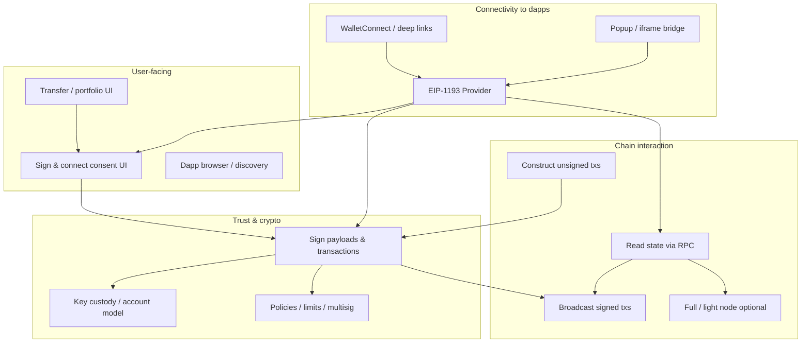
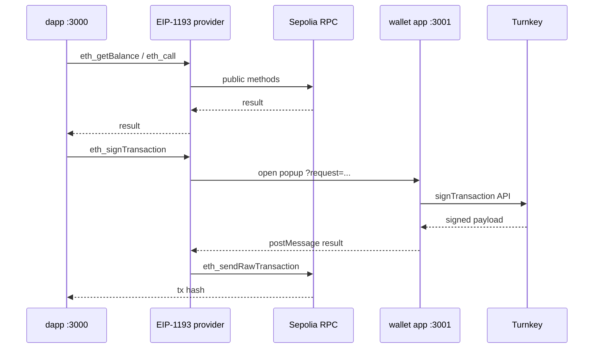

# What is a “wallet”? — A layered mental model

**Date:** 2026-06-02  
**Context:** Clarifying overloaded terminology before designing Superfluid / Turnkey integrations (`popup-wallet-demo`, `wallet-poc`, embedded wallet research).

---

## TL;DR

**“Wallet” is not one thing.** In conversation it often means “the app MetaMask users install,” but in specs and architecture it is better treated as a **bundle of separable capabilities**. Different products implement different subsets:

| Capability | Often included? | Who might own it |
|------------|-----------------|------------------|
| Key custody & recovery | Usually | Wallet app, HSM, MPC (Turnkey), hardware |
| Cryptographic signing | Usually | Same as custody, or delegated (4337 bundler, co-signer) |
| User consent UI | Usually | Wallet popup / extension |
| Chain read access (RPC) | Sometimes | Wallet, dapp, or shared infra |
| Tx broadcast | Sometimes | Wallet, dapp, or relayer |
| Full/light node | Rare today (web) | Was core in Mist-era desktop wallets |
| Transfer / portfolio UI | Sometimes | Wallet app only |
| Dapp connectivity | Modern default | Provider (`window.ethereum`), WalletConnect, popup bridge |

When someone says **“wallet”** in a repo name, ask: **which layers does this folder implement?**

---

## Why the word is fuzzy

Historically (Bitcoin desktop clients, **Mist**), a “wallet” was a **thick client**: local keys + local or P2P chain sync + send UI + often a dapp browser. Ethereum’s web dapp model **split** that stack:

1. **Dapp** runs in an untrusted origin and wants chain access + signatures.
2. **Provider** (`window.ethereum`, EIP-1193) is the narrow API the dapp actually calls.
3. **Wallet** (in EIP terms) holds keys and signs; it may live in an extension, mobile app, popup, or cloud MPC.
4. **Client** (EIP-1193 “Client”) is whatever answers JSON-RPC — often a remote HTTP endpoint, not a node on your laptop.

So “wallet” in marketing (“Connect wallet”) ≠ “wallet” in [EIP-1193](https://eips.ethereum.org/EIPS/eip-1193) ≠ “wallet” in `popup-wallet-demo` (one of two apps in a monorepo).

---

## Normative split: EIP-1193

[EIP-1193](https://eips.ethereum.org/EIPS/eip-1193) defines three roles (paraphrased):

- **Provider** — JavaScript object exposed to the dapp; forwards RPC; emits `accountsChanged` / `chainChanged`. **Not** responsible for key management.
- **Wallet** — End-user app that **manages private keys**, **performs signing**, and sits **between Provider and Client**.
- **Client** — Endpoint that receives RPC and returns results (historically “Ethereum node”; today usually **JSON-RPC over HTTPS**).

Important quote from the spec (non-normative but widely cited):

> The Provider is not responsible for private key or account management … In practice, we call these middleware applications “Wallets.”

References: [EIP-1193](https://eips.ethereum.org/EIPS/eip-1193), [EIP-1102](https://eips.ethereum.org/EIPS/eip-1102) (`eth_requestAccounts`), [EIP-1474](https://eips.ethereum.org/EIPS/eip-1474) (JSON-RPC surface), [EIP-2255](https://eips.ethereum.org/EIPS/eip-2255) (`wallet_requestPermissions`).

---

## A capability-layer model (our working taxonomy)

Think in **layers**. A product can implement one layer, many, or delegate layers to another process/origin.

### Layer notes (expanded from your list + common additions)

| Layer | What it does | Examples / notes |
|-------|----------------|------------------|
| **Key custody** | Hold or derive signing authority; persistence | Local encrypted keystore, Secure Enclave, Ledger, **Turnkey MPC** (key material never in dapp) |
| **Backup / recovery** | Restore access after loss | Seed phrase, social recovery, Turnkey sub-org + passkey, multisig guardians |
| **Signing** | Produce signatures over hashes / typed data / txs | `personal_sign`, EIP-712, `eth_signTransaction`, 4337 UserOp signing |
| **Policy / governance** | What may be signed without human each time | Turnkey policies, session keys, Safe modules, EIP-7702 delegations |
| **Account model** | What “an account” is | EOA, smart account (4337), multisig contract |
| **Chain read (RPC)** | `eth_call`, balances, logs, gas estimates | Alchemy, public RPC, wallet’s own node |
| **Node (full/light)** | Verify chain locally; P2P | Mist, Geth attached to old Mist; rare in browser wallets today |
| **Tx construction** | Nonce, gas, calldata assembly | Often dapp (viem/wagmi); wallet may refine or reject |
| **Broadcast** | Submit signed tx to mempool | Wallet, dapp, or public RPC (`eth_sendRawTransaction`) |
| **Consent UI** | Human-readable approve/deny | Extension popup, `popup-wallet-demo` `:3001` |
| **Portfolio / transfer UI** | Send ETH/tokens without a dapp | MetaMask home, embedded wallet dashboard |
| **Address book / names** | Contacts, ENS | Optional wallet feature |
| **Dapp platform** | Browse, inject provider, WC pairing | MetaMask browser, Rabby, Reown |
| **Provider API** | What dapps code against | `window.ethereum`, custom EIP-1193, wagmi connector |

---

## “Wallet” vs “provider” vs “signer” (everyday dev vocabulary)

| Term | Typical meaning in codebases |
|------|------------------------------|
| **Wallet (product)** | Branded app the user trusts for money |
| **Wallet (EIP-1193)** | Key + signing middleware behind the provider |
| **Provider** | `request({ method, params })` + events — may be **composite** |
| **Signer** | Library/type that only signs (viem `Account`, Turnkey API) — no RPC, no UI |
| **Connector** | wagmi/RainbowKit adapter that connects dapp state to a provider |
| **Custodian** | Legal/ops entity holding keys (exchange) — overlaps “wallet” in UX only |

**Rule of thumb:** If it has no keys and no signing, it is probably a **provider façade** or **RPC proxy**, not a wallet in the EIP sense — even if the repo is named `wallet`.

---

## Case study: `popup-wallet-demo`

The monorepo name says “wallet,” but the **split is explicit**:

| Component | Layers it implements |
|-----------|----------------------|
| **`apps/wallet`** | Custody (via Turnkey), signing, **consent UI**, auth/session on wallet origin |
| **`apps/dapp/lib/eip1193-provider.ts`** | **Provider** + RPC routing: reads/broadcast → public RPC; wallet ops → popup |
| **`apps/dapp`** | Dapp UI, tx construction (wagmi), **not** key custody |
| **Turnkey** | MPC keystore + signing API; backup/recovery via their auth model |

So here **“wallet” = the `:3001` app + Turnkey backend**, not the whole repo. The dapp implements a **hybrid provider** that is only a “wallet” for methods routed to the popup.

Same pattern applies to a future `wallet.superfluid.org` + `app.superfluid.org` (see [`tmp/turnkey-embedded-wallet-research.md`](../tmp/turnkey-embedded-wallet-research.md)).

---

## Modern variants (same layers, different packaging)

| Style | Custody / sign | Provider exposure | RPC / broadcast |
|-------|----------------|-------------------|-----------------|
| **Browser extension** | Extension | Injects `window.ethereum` | Often wallet’s RPC |
| **Mobile app** | App secure storage | WC / deep link | App or infra RPC |
| **Embedded (Turnkey kit)** | Cloud MPC + iframe/popup | In-page or bridge | Dapp or wallet chooses |
| **Smart account (4337)** | Contract + signer keys | Bundler + paymaster | Relayer network |
| **Hardware** | Device | Bridge software | Host app’s RPC |
| **Server agent (HFA `turnkey/`)** | API keys, co-signing | HTTP API, not EIP-1193 | Server | 

**EIP-7702** blurs “EOA vs smart wallet” at the **account** layer while leaving the provider/wallet split intact ([EIP-7702](https://eips.ethereum.org/EIPS/eip-7702)).

---

## Practical questions when someone says “wallet”

1. **Where do keys live?** (device, extension, MPC, contract, multisig)
2. **Who shows the approve UI?** (same origin as dapp or isolated origin)
3. **What implements EIP-1193 toward the dapp?** (injected, connector, popup bridge)
4. **Who runs RPC?** (dapp, wallet, third party — and for which methods)
5. **Who broadcasts?** (`eth_sendTransaction` end-to-end vs sign + `eth_sendRawTransaction`)
6. **Is there a product UI beyond signing?** (dashboard, send, swap)
7. **Recovery story?** (seed, passkey, org admin, social)

---

## Suggested vocabulary for our repos

To reduce confusion in design docs and PRs:

| Say | Instead of |
|-----|------------|
| **Wallet app** / **signing surface** | “the wallet” when meaning UI + Turnkey session |
| **Provider** or **EIP-1193 bridge** | “wallet” when meaning `eip1193-provider.ts` |
| **Signer backend** | “wallet” when meaning Turnkey/HSM only |
| **RPC layer** | assuming the wallet runs a node |
| **Connector** | “wallet” in wagmi/RainbowKit config |

---

## References

- [EIP-1193: Ethereum Provider JavaScript API](https://eips.ethereum.org/EIPS/eip-1193) — Provider / Wallet / Client definitions
- [EIP-1102](https://eips.ethereum.org/EIPS/eip-1102) — `eth_requestAccounts`
- [EIP-1474](https://eips.ethereum.org/EIPS/eip-1474) — JSON-RPC methods
- [EIP-2255](https://eips.ethereum.org/EIPS/eip-2255) — `wallet_*` permissions
- [EIP-4337](https://eips.ethereum.org/EIPS/eip-4337) — Account abstraction (smart account “wallets”)
- [EIP-7702](https://eips.ethereum.org/EIPS/eip-7702) — EOA code delegation
- [Turnkey embedded consumer wallet](https://docs.turnkey.com/solutions/embedded-wallets/embedded-consumer-wallet)
- Local: [`popup-wallet-demo` README](../../popup-wallet-demo/README.md), [`tmp/turnkey-embedded-wallet-research.md`](../tmp/turnkey-embedded-wallet-research.md)
- Historical: [Mist browser](https://github.com/ethereum/mist) — example of node + wallet + dapp browser in one desktop “wallet”

---

## Open questions (for later)

- Where should **Superfluid wallet** draw the RPC/broadcast boundary (always dapp vs wallet-owned RPC)?
- Is **session persistence** part of “wallet” or “provider” UX?
- How do **policies** (Turnkey) relate to EIP-2255 **permissions** in product copy?
